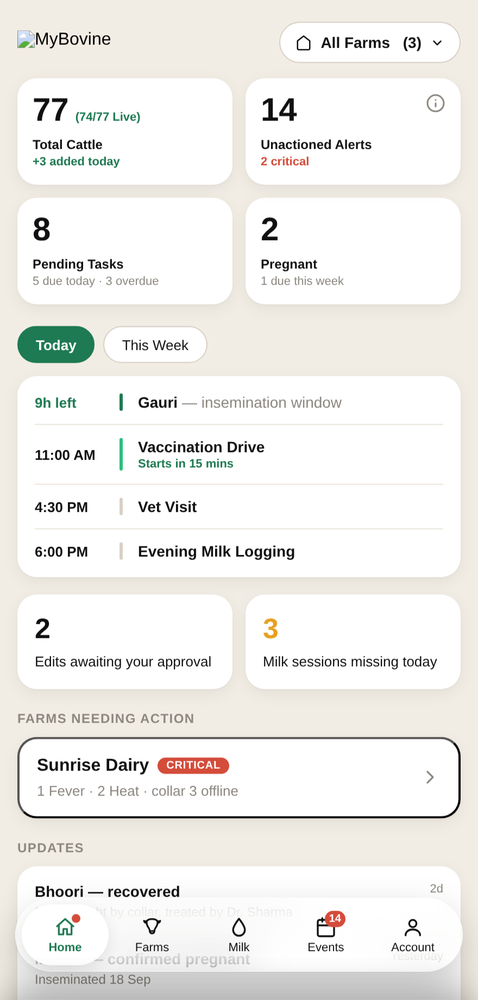
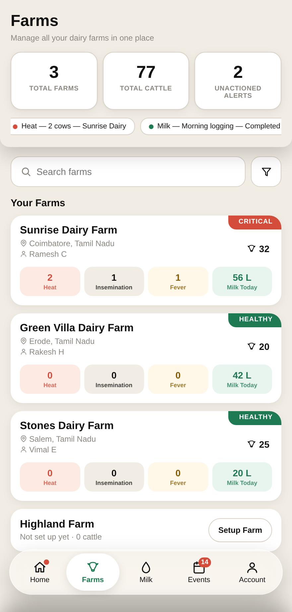
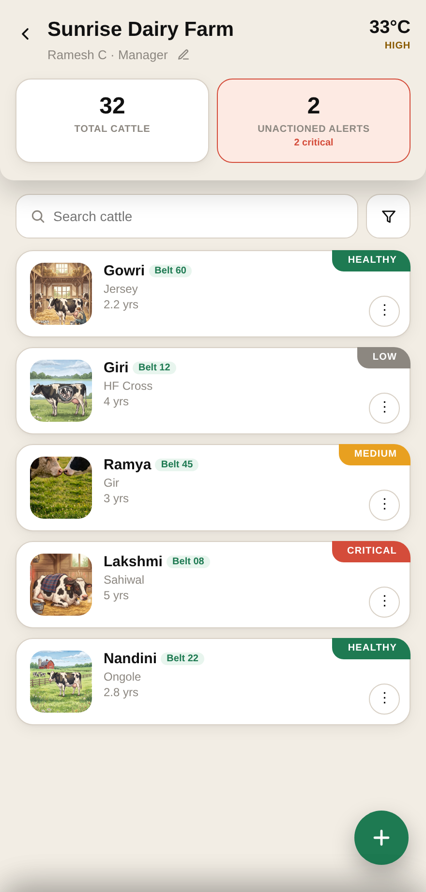
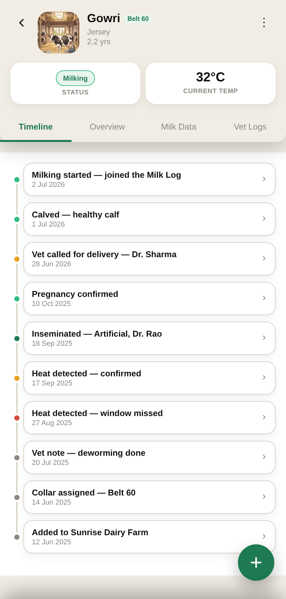
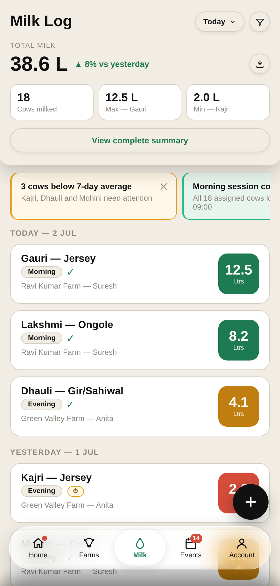
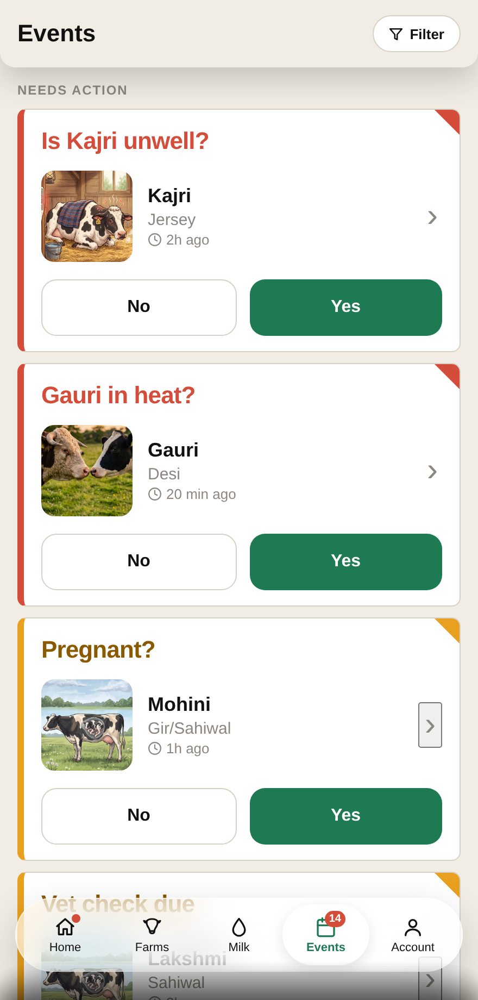

# MyBovine.ai — Farmer Mobile App
### Feature Requirement Document

| | |
|---|---|
| **Author** | Vasudevan Venkataraman |
| **Team** | Intelligent Apps |
| **Product Manager** | Ashwin |
| **Engineering Lead / Team Lead** | Praveen |
| **Design Lead** | Vasudevan V |
| **Approvers / Sign-Off** | Vanix Team |
| **Status of PRD** | Draft |

> **Live prototype:** https://vaseey21.github.io/Vanix/prototype.html · **Screen gallery:** https://vaseey21.github.io/Vanix/vanix_screens.html
> **Design source (Figma):** `vanix_sketches.fig` — _add shareable Figma link here_

---

## Overview

MyBovine.ai is an IoT-powered cattle-health monitoring app for dairy farmers in India, built by Vanix Technologies. Each cow wears a smart collar that streams temperature and movement data; the app turns that raw signal into plain-language, one-tap actions — detecting heat, fever, calving and other events, and walking the farmer through what to do next (confirm heat, call a vet, log insemination, record milk).

This FRD covers the **mobile app** for the two field-facing personas — **Farm Owner** and **Farmer**. The Vanix Admin and Distributor personas are served by a separate web app and are out of scope here.

---

## Problem

Small and mid-size Indian dairy farmers lose milk yield and breeding cycles because health and reproductive events (heat, fever, mastitis, calving distress) are caught late or missed entirely. Detection today depends on constant human observation, which does not scale across multiple cows or multiple farms, and record-keeping is informal (memory, paper, WhatsApp). The result: missed insemination windows, untreated illness, disputed milk logs, and no reliable history for vets or buyers.

**Problem statement:** Farmers need a low-literacy, low-friction way to know *which cow needs attention right now and what to do about it*, and owners need oversight across farms and staff — without either persona having to read dashboards or interpret sensor data.

---

## Objectives

Per the client discussions, the product must achieve the following:

1. Surface **immediate, actionable alerts** (heat, fever, calving, insemination window) the moment the collar detects them, in the farmer's language.
2. Give every alert a **single clear next action** (Yes/No, Call vet, Log) — never a raw data readout.
3. Support **multi-farm oversight** for owners and **single-farm focus** for farmers, from one codebase.
4. Keep a **trustworthy audit trail** of every status change, milk entry and vet visit.
5. Work for **low-literacy, multilingual users** — Hindi (default), Bhojpuri, English; icon-plus-label over sentences; picture-first alert cards.
6. Remain usable **offline / on poor networks** and on a wide range of Android devices.
7. Enforce **role-appropriate permissions** — owners approve, farmers request.

---

## Persona

**Who are the target personas, and which is the key persona?**

- **Farm Owner** — Owns/operates one or more farms; manages farms, farmers, cattle, groups and vet relationships; approves milk edits and oversees alerts across all farms. *(Oversight persona.)*
- **Farmer** ⭐ **(key persona)** — Works the cattle day-to-day on one or a few farms; logs milk, responds to health/heat alerts, calls the vet. Lower literacy, needs the fastest path from "something's wrong" to "done." The whole product is optimised around this persona.

> Vanix Admin and Distributor are **web-only** and not addressed in this document.

---

## Use Cases

**Scenario 1 — Heat caught in time (Farmer).** The collar flags Ramya in heat at 6 AM. The farmer's Home opens on an **Immediate** card "Heat detected — Ramya." He taps it, confirms "Yes, in heat," picks a vet, and logs artificial insemination inside the optimal window — all in under a minute, in Hindi.

**Scenario 2 — Owner oversight across farms.** James, who owns three farms, opens the dashboard and sees "14 Unactioned Alerts · 2 critical." He taps the info button, sees Sunrise Dairy has a suspected fever in Kajri, triages it, and reassigns a farm manager — without visiting the farm.

**Scenario 3 — Disputed milk entry.** A farmer logs an evening milk entry late and edits the litres. The edit is submitted as a **pending request**; the owner sees it under "Edits awaiting your approval," approves it, and the entry updates with an "Updated" badge and a full audit trail.

---

## Features In

Prioritized features shipped in the prototype (P0 = must-have for the key persona):

| # | Feature | Why it matters / scope |
|---|---|---|
| 1 | **Events / alert centre (P0)** | The heart of the product — a 14-card P0–P3 taxonomy (Fever, Heat→Insemination window, Pregnancy check, Gestation, Milking, Mastitis/Lameness/Ketosis, etc.) with in-place card morphing, live badge sync, and picture-first illustration cards. Each card ends in one action. |
| 2 | **Farmer Home — Immediate / To-dos (P0)** | Simplified, action-first home for the key persona: two tabs — *Immediate* (heat, sickness, delivery) and *To-dos* (vet appointment, insemination window, milk logging) — each row opening its event card. |
| 3 | **Milk Log + Add/Edit entry (P0)** | Morning/Evening sessions only; date/session guards (no future entries; Evening locked till 17:00); duplicate guard; owner-approval workflow for farmer edits. |
| 4 | **Cow Profile (P1)** | Timeline (tap-to-expand event history), Overview (vitals + 24h temperature graph), Milk Data (8-week yield), Vet Logs; a floating **+** multi-step flow engine to log heat/insemination/pregnancy/delivery/status/vet visit. |
| 5 | **Farms list + Farm detail (P1)** | Owner: multi-farm overview with severity tags. Farm detail: temperature hero, cattle list, filters, add-cattle. |
| 6 | **Owner Dashboard (P1)** | 2×2 stat tiles, unactioned-alerts detail sheet with triage, Today/This-week schedule, farms-needing-action, updates feed. |
| 7 | **Account & settings (P1)** | Profile, alert-sound toggle, language switch (en/hi/bho), dark mode, legal, help; owner-only: Farm Management, Cattle Groups, Vet onboarding. |
| 8 | **Localization + accessibility (P0)** | Hindi/Bhojpuri/English; Noto + Noto Devanagari; icon+label pattern; Text/Image display mode; dark mode app-wide. |

---

## Features Out

Explicitly **not** in scope for this mobile app, and why:

- **Device / collar management** (pairing firmware, battery dashboards, calibration UI beyond the "Calibration complete" alert) — handled by the hardware provisioning flow / web console.
- **Client (Vanix Admin) persona** — web app only; manages tenants, onboarding, billing.
- **Distributor persona** — web app only; manages device inventory and territory.
- **Advanced analytics / BI reporting** — the mobile app shows farmer-facing summaries only; deep reporting lives in the web console.
- **In-app payments / marketplace** — not part of this phase.

---

## Design

**Figma:** `vanix_sketches.fig` — _add shareable link_. Live prototype linked at the top of this document. The design system is documented in `vanix_design_system.html`.

### Sketches (early)

Six essentials pulled from the sketch file, representing the core loop *detect → decide → act → record*:

1. **Alert card** — picture-first, one question, Yes/No.
2. **Farmer Home** — Immediate vs To-dos tabs.
3. **Cow profile** — timeline + vitals.
4. **Milk log** — session-based entry.
5. **Farms overview** — multi-farm severity.
6. **Heat → insemination flow** — the single evolving 24-hour card.

_→ Link each sketch to its Figma frame once shareable URLs are available._

### Wireframes — accepted vs rejected

**Accepted**
- **Picture-first illustration alert cards** (cow · breed → line-art icons → question → Yes/No) — highest comprehension for low-literacy users.
- **Frosted floating bottom nav** with a single sliding capsule (Starbucks-style) — warm, familiar, thumb-reachable.
- **Text / Image display mode toggle** — lets farms choose scannable contained-photo cards or full-bleed photo cards.
- **Warm background (#F2EDE4), never pure white** — reduces glare in daylight field use.
- **Single evolving Heat→Insemination card** on one real 24-hour clock — instead of separate alerts per phase.

**Rejected**
- **Stacked "P0 · CRITICAL" + separate "ESCALATED" chips** — said the same thing twice; replaced by one corner "!" roundel.
- **Afternoon milk session** — real farms log Morning + Evening only.
- **Green (#4DDE95) text on white** — fails WCAG AA; green is accent-only, `greenInk #1E7A52` for text on white.
- **Raw sensor charts as the primary alert surface** — farmers want the decision, not the data; graphs demoted to Cow Profile detail.
- **Bell + avatar in the dashboard header** — redundant with the bottom nav; removed.

### Each Page

> **Convention:** each page is described as **Top → Elements → What follows**. Sections marked **[Farm Owner only]** are hidden for the Farmer persona.

#### Home — Farm Owner

1. **Top:** MyBovine logo (left) + All-Farms selector (right). Extra top padding clears the device status bar.
2. **Stat grid (2×2):** Total Cattle (with live-collar count), Unactioned Alerts (info button → detail sheet), Pending Tasks, Pregnant.
3. **Schedule:** Today / This-week tabbed list (insemination windows, vaccination drives, vet visits, milk logging).
4. **Two half-cards:** Edits awaiting approval **[Farm Owner only]** · Milk sessions missing today.
5. **Farms needing action** — per-farm severity row → opens Farm Detail. **[Farm Owner only]**
6. **What follows:** Updates feed (recovered / confirmed pregnant / calved).

#### Home — Farmer
1. **Top:** MyBovine logo (left) + "Your farm today" (right).
2. **Two tabs:** **Immediate** (default) and **To-dos**.
3. **Immediate list:** Heat detected, Fever alert, Delivery due — each a coloured-bar row with title, one-line subtitle, and an **Open** button that opens the matching event card.
4. **To-dos list:** Vet appointment, Insemination window, Evening milk logging — lower-priority rows, same row pattern + action button.
5. **What follows:** empty-state "All clear" when nothing is pending.
6. **Routing:** a Farmer with **multiple farms** also gets the Farms tab (read-only, no farm-level edit); a Farmer with **one farm** goes straight into that farm's detail page with full in-farm features.

#### Farms list **[Farm Owner; read-only for multi-farm Farmer]**

1. **Top:** hero card — title, 3 stat tiles (Total Farms / Total Cattle / Unactioned Alerts), auto-scrolling activity ticker.
2. **Elements:** search + funnel filter (Status / Location); farm cards (name, location, manager, severity tag, cattle count, event chips); dashed "Setup Farm" rows.
3. **What follows:** tapping a card → Farm Detail.

#### Farm Detail (cow list)

1. **Top:** back chevron + farm name + manager (with edit pencil **[Farm Owner only]**), farm temperature + level.
2. **Elements:** two tiles (Total Cattle / Unactioned Alerts); search + filter (Status/Breed/Age); cow cards (photo, name+belt, breed, age, severity corner tag, kebab: Edit / Delete / Add to group).
3. **What follows:** tap a cow → Cow Profile; **+** FAB → Add Cattle.

#### Cow Profile

1. **Top:** back + photo + name/belt/breed/age + kebab; Status + Current Temp tiles; tabs.
2. **Tabs:** Timeline (tap-to-expand event cards, dots centered on the rail), Overview (stat cards + 24h temperature line + activity + reminders), Milk Data (8-week yield graph w/ axes), Vet Logs.
3. **What follows:** floating **+** → multi-step actions (change status, request vet visit, add vet log, add heat/insemination/pregnancy/delivery — each with date/time fields).

#### Milk Log + Add/Edit entry

1. **Top:** cream hero, milk-scoped banners, date-grouped entry cards with coloured yield boxes.
2. **Elements:** two-pane filter sheet; Add/Edit entry page (farm+cow+date+session pills+litres) with future-date/session guards and duplicate guard.
3. **Approval:** owner edits apply directly and owners **approve** farmer edits **[Farm Owner only]**; farmer edits are submitted as a **pending request** and shown as such until approved.
4. **What follows:** "View complete summary" → analytics (8-week trend, top-5 cows, yield by breed).

#### Events / alert centre

1. **Top:** title + filter chips (All / Needs action / Warnings / Reminders).
2. **Elements:** P0–P3 alert cards (picture-first for Fever/Heat/Pregnancy), single red corner badge for escalated P0, date-grouped history, reminders with progress bars.
3. **What follows:** card → Card Detail (sensor graphs + CTAs) or the full-screen Heat carousel / "View full cycle" walkthrough.

#### Account
1. **Top:** profile row (name, role) → read-only Profile.
2. **Elements:** Farm Management **[Farm Owner only]**, Cattle Groups **[Farm Owner only]**; Alerts & Contacts (alert-sound toggle; Vet & Emergency Contacts / vet onboarding **[Farm Owner only]**); App (language, dark mode); Legal; Support; Log Out.
3. **What follows:** each row opens its sub-page.

### Farm-Owner-only sections (summary)
- Owner Dashboard (multi-farm stats, farms-needing-action, edits-awaiting-approval)
- Farm-level edit (rename, manager assign/invite) on Farm Detail
- Milk-edit **approval** (farmers only submit pending requests)
- Account → Farm Management, Cattle Groups, Vet onboarding
- Read-only Farms tab for multi-farm Farmers (view, no edit)

---

## Technical Considerations

### Front End
- **Flutter** (Dart) — single codebase, Android-first; `flutter_app/` mirrors the HTML design spec. Theme tokens centralised in `vanix_theme.dart`.
- Persona/role gating driven by an `AppState` flag (`owner` / `farmer`) + farm-count; role controls routing, nav, hidden sections and the milk-edit path.
- Localization: `FS.t(lang, key)` table (en/hi/bho), Hindi default; `EdgeInsetsDirectional` throughout for future RTL (Urdu, Phase 4).
- Bundled Noto Sans + Noto Sans Devanagari; no runtime font fetch. Custom painters for temperature/yield graphs (thin strokes, non-scaling).
- Offline-first: every screen needs a dark offline banner; cache last-known collar readings and queued milk/edit requests.
- Accessibility: min 48×48 dp targets, min 14 px body, AA contrast, icon+label.

### Back End
- Ingest collar telemetry (temperature + movement) and run **Cattle Health Logic v3.1** (10-day rolling baselines) to raise P0–P3 events; push + in-app delivery with the escalation ladder (0 h farmer → 1 h owner → 2 h critical → 6 h confirmed).
- Event state machine mirroring the cow lifecycle (Idle → Heat → Inseminated → Pregnant → Calved → Milking → Dry) and the single evolving 24-hour heat clock.
- Role-based access control: owner vs farmer permissions; **milk-edit approval queue** (pending → approved/rejected) with immutable audit log of status changes, milk entries and vet visits.
- Vet onboarding via emailed confirmation links (pending → confirmed/declined).
- APIs: farms, cattle, groups, milk logs, events, vets, users/roles. Multi-tenant, DPDP-compliant (PII minimisation, encryption at rest, no PII in logs/URLs).
- Notifications: push (FCM) + SMS fallback for escalations.

---

## Success Metrics

- Clear requirements documented and finalised for the farmer + owner personas.
- Visuals fully approved by the client with minimal iterations.
- A stable, robust backend for telemetry ingest + event generation.
- Pixel-perfect front-end matching the approved design.
- Testing with 0 functional bugs at demo.
- Demo to the Vanix / client team.
- **Product KPIs:** % of heat events actioned within the optimal window; median time from alert → farmer action; milk-log completeness (sessions logged / expected); alert precision (actioned vs dismissed-as-false); D30 farmer retention.

> Note: link to the Analytics requirements & approach document.

---

## Open Issues

- Exact routing for a single-farm Farmer on login — land on the simplified Home, or directly on Farm Detail? (Prototype assumption: Home, with one-tap Farms → Farm Detail.)
- Depth of "read-only" for multi-farm Farmers — can they edit cow records but not farm-level settings? (Assumed yes.)
- Deep-linking the Farmer Home action buttons to the *specific* event card vs. the Events list.
- Offline conflict resolution when a queued milk edit and an owner approval race.
- Bhojpuri copy review by a native speaker.

---

## Q&A

| Asked by | Question | Answer |
|---|---|---|
| Design | Do farmers see analytics dashboards? | No — farmers get an action-first Home; analytics stay owner/web-side. |
| Eng | How is persona decided? | Role flag on the account; prototype exposes a demo toggle to switch Owner ⇄ Farmer and 1 ⇄ many farms. |
| Client | Can a farmer approve their own milk edit? | No — farmer edits are pending requests; only the owner approves. |
| Eng | Afternoon milk session? | No — Morning + Evening only, everywhere. |

---

## Feature Timeline & Phasing

| Feature | Status | Dates |
|---|---|---|
| FRD finalize | In progress | — |
| Design (HTML prototype + design system) | Shipped | — |
| Front End (Flutter) | In progress | — |
| Back End | Planned | — |
| Testing | Planned | — |
| Demo to client | Planned | — |
